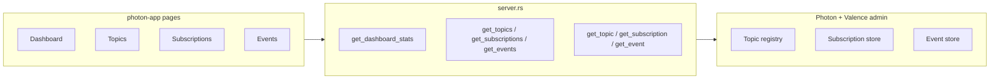

# Photon App UI & Quality Audit

**Audit date:** 2026-06-30  
**Scope:** All Leptos routes and UI components in `photon-app` (25 Rust source files, ~1,764 lines per Sentrux scan)  
**Reference canon:** Orbital Introduction (`/orbital`), [`.cursor/rules/20-ui-orbital-principles.mdc`](../.cursor/rules/20-ui-orbital-principles.mdc), [`.cursor/rules/21-ui-implementation-patterns.mdc`](../.cursor/rules/21-ui-implementation-patterns.mdc), [`.cursor/rules/31-async-boson-chronon-photon.mdc`](../.cursor/rules/31-async-boson-chronon-photon.mdc), valence-app schema index + help components, [`boson-app/BOSON_UI_AUDIT.md`](../boson-app/BOSON_UI_AUDIT.md), [`chronon-app/CHRONON_UI_AUDIT.md`](../chronon-app/CHRONON_UI_AUDIT.md)

**Baseline metrics (Sentrux `scan` on 2026-06-30):**

| Metric | Value |
|---|---|
| Files scanned | 26 |
| Total lines | 1,764 |
| Import edges | 35 |
| Quality signal | 6,995 |
| Structure grade | D (from [`QUALITY.md`](QUALITY.md), 2026-03-17) |
| Architecture grade | A (from [`QUALITY.md`](QUALITY.md), 2026-03-17) |

---

## Executive summary

Photon-app is **Orbital-first at the shell and page chrome level**: every route uses `ContentContainer`, typography presets (`Title3`, `Subtitle2`, `Body1`), `Card`/`StatCard`, and `UnifiedFieldShellLayout`. The app is usable for developers and operators inspecting event pipelines, but under-serves the **open-platform audience** with no contextual help (`InfoLabel`), no skeleton loading states, hand-rolled tables and card lists instead of `DataTable`, no time-series charts, and no photon-leptos live subscriptions despite being the Photon operations UI.

| Category | Pass | Violations | High severity |
|---|---:|---:|---:|
| Orbital surfaces & layout | Partial | 14 | 0 |
| Typography & raw HTML | Partial | 11 | 0 |
| Presentation & InfoLabels | Fail | 18 | 0 |
| Async (Suspense/Transition/skeletons) | Partial | 9 | 0 |
| DataTable / charts | Fail | 7 | 0 |
| Code quality (god files, composition, structure) | Partial | 10 | 1 |
| Test IDs | Partial | 1 gap set | 0 |
| **Functional wiring** | Partial | 4 | **1** |

**Top findings:**

1. **High — Checkpoint lag stubbed to zero:** [`server.rs`](src/server.rs) line 196 sets `checkpoint_lag: 0i64` for every subscription; the UI displays lag in dashboard, subscription cards, and meta cards but the value is never computed.
2. **Medium — No skeleton loading:** All seven routes use `<Card>"Loading..."</Card>` or bare `<div>"Loading..."</div>` instead of Orbital `Skeleton`/`SkeletonItem`.
3. **Medium — No InfoLabel usage anywhere:** Domain jargon (seq, checkpoint lag, keyed-by, mode, delivery status, transport expired) lacks the valence-app help pattern.
4. **Medium — Hand-rolled lists and tables:** Topics, subscriptions, and events index pages miss `DataTable` search/filter/list-view affordances ([valence schema index](../valence-app/src/pages/schema_index/components/schema_table/schema_data_table.rs) reference).
5. **Medium — No photon-leptos subscriptions:** The Photon operations app does not use `#[photon::synced]` or client subscribe hooks for live dashboard/events data (counter-app live page pattern).

**Phased remediation estimate:**

| Phase | Focus | Effort |
|---|---|---|
| P0 | Audit document (this file) | Done |
| P1 | Quick wins (skeletons, test ids, `<a>` → `Link`, page subtitles, fix lag stub) | S–M |
| P2 | Help & composition (`PhotonHelpCardHeader`, route folders, `EventsTableConfig`) | M |
| P3 | DataTable migration (topics → subscriptions → events) | M–L |
| P4 | Dashboard charts + time-series server endpoints | M |
| P5 | Async + Photon live updates | M |
| P6 | Server refactor + unit tests | L |
| P7 | Motion polish (optional) | S |

---

## Audience & product intent

Photon is the platform UI for **publish/subscribe event pipelines** — registered topics, consumer subscriptions, and event history. Any **registered authenticated user** can browse; the app is read-only today (no create/edit flows in UI).

| Persona | Primary goals | UX expectations |
|---|---|---|
| **Platform developers** | Inspect topic schemas, debug subscriptions, trace events by seq/key | Dense metadata OK; needs InfoLabels on seq, checkpoint lag, keyed topics, delivery status, mode |
| **Product support / ops** | Monitor subscription health, spot lag, inspect failed/expired payloads | Scan-friendly status badges with text, filterable lists, clear transport-expired warnings |
| **General registered users** | Understand what Photon does on the platform | Plain-language page intros; avoid unexplained jargon (seq, checkpoint lag, keyed-by, mode) |

The app today optimizes for the **developer/ops** persona (metadata-heavy cards, table snapshots, status badges) but does not explain domain concepts to general users.

---

## Audit methodology & scoring legend

Each route section is scored against four dimensions:

1. **Orbital conformance** — surfaces, layouts, typography, DataTable/charts, raw HTML
2. **Presentation** — purpose, hierarchy, InfoLabels, focus, materials/color
3. **Async** — Suspense vs Transition, skeletons vs spinners, Photon streaming
4. **Code quality** — file size, composition, props, test ids, directory structure

**Severity:**

| Level | Meaning |
|---|---|
| **High** | Broken behavior or blocks maintainability/testing |
| **Medium** | UX inconsistency or missed platform capability |
| **Low** | Polish, minor convention drift |

**Pass criteria:** Explicit evidence cited; "Pass" only when no Medium+ violations in that dimension.

---

## Orbital conformance rules (expanded reference)

These rules are applied consistently across all route audits below.

### Surfaces & elevation

| Context | Expected | Violation signal |
|---|---|---|
| App shell (nav, AppBar) | `UnifiedFieldShellLayout`; nav `NavigationMaterial`; flat shell elevation | Hardcoded shell backgrounds; shadow on nav items |
| Page canvas | Lightest neutral; `ContentContainer` as focus surface | Page-level turf overriding canvas tokens |
| Section content | One `Card` at **Resting** (`--shadow4`) per logical block | Card wrapping Card without hierarchy intent |
| Stat / KPI tiles | `StatCard` (already elevated) — **not** nested inside another Card | Card > StatCard |
| List item tiles | Each item owns one surface; page list should not add redundant outer Card | Topics/subscriptions: outer `Card` wrapping hand-rolled bordered div cards |
| Dialogs / overlays | `Dialog` + scrim for modals | Inline overlays |
| Status chips | `Badge` + text label | Color-only status |

**Layering rule:** Canvas (flat) → section Card(s) at Resting → emphasis via typography and badges, not nested Cards. At most one Raised emphasis per viewport region. Hand-rolled bordered divs (`TopicCard`, `SubscriptionCard`) duplicate Card semantics without elevation tokens.

### Layouts

| Component | Use when |
|---|---|
| `ContentContainer` | Every page (max-width centering) |
| `Flex vertical + SpacingSize::Size240` | Page section stack |
| `Flex justify=SpaceBetween` | Title + primary action row |
| `Stack` | Even-gap vertical sections, form fields |
| `Grid` / `GridConfig` | Metadata key/value grids on detail pages |
| `AutoGrid` | Fluid card walls (topics/subscriptions index) |
| `Table` in Card | Wide tabular snapshots (dashboard, detail embeds) |
| `DataTable` + `LIST_VIEW` | Search, filter, sort, card/table toggle |

### Typography

| Role | Preset |
|---|---|
| Page title | `Title3` |
| Section header | `Subtitle2` (+ optional `CardHeaderDescription`) |
| Body | `Body1` |
| Metadata / timestamps | `Caption1` / `Caption2` |
| Form labels | `Label` + `FormHint`; domain fields add `InfoLabel` |
| Monospace (JSON, ids) | `Text tag=TextTag::Pre` + `TextFont::Monospace` |

Prefer presets over raw elements + inline font styles. Avoid inline `style=` on typography components — use turf classes or spacing props.

### DataTable vs hand-rolled Table

When a list has **search**, **multi-filter**, **sort**, **column help**, or **list/card view toggle**, prefer `DataTable` with optional `DataTableFeatures::LIST_VIEW` (valence schema index pattern). Small fixed snapshots (dashboard recent events, ≤10 rows) may remain hand-rolled `Table`.

Reference: [`schema_data_table.rs`](../valence-app/src/pages/schema_index/components/schema_table/schema_data_table.rs).

### Charts

Use `orbital-charts` (`LineChart`, `BarChart`, `AreaChart`, `Sparkline`) when time-series or categorical aggregates aid scanning. Requires server series data — `DashboardStats` today is point-in-time counts only.

Reference: [`valence-app/src/pages/dashboard/charts.rs`](../valence-app/src/pages/dashboard/charts.rs).

### InfoLabel rules (concrete)

Mirror valence [`ValenceHelpCardHeader`](../valence-app/src/components/help/card_header.rs) and [`ValenceHelpColumnHeader`](../valence-app/src/components/help/table_header.rs):

| Apply InfoLabel when | Photon examples |
|---|---|
| Section title with domain jargon | "Checkpoint lag", "Recent events", "Subscriptions for this topic" |
| Table column with non-obvious semantics | Seq, Key, Created, Mode, Lag |
| Detail field needing format guidance | Schema JSON, Keyed-by, Delivery status, Actor JSON |
| Status needing disambiguation | ON/OFF subscription, transport expired |
| Metric needing scope | "Events (24h)" — UTC window clarification |
| Empty state next step | "No topics" → explain topic registration |

Do **not** InfoLabel every form `Label` — only domain-specific or operational fields. Wrap `data-testid` on native `<div>` around `InfoLabel` (E2E rule).

### Async rules

| Scenario | Mechanism |
|---|---|
| Initial SSR load | `Suspense` + `Skeleton`/`SkeletonItem` |
| Refetch / filter change | `Transition` + skeleton (avoid full-page flash) |
| Button in-flight | Disabled + label change |
| Live pipeline data | `#[photon::synced]` + client subscribe + `Transition` |

Per [`.cursor/rules/21-ui-implementation-patterns.mdc`](../.cursor/rules/21-ui-implementation-patterns.mdc): use `<Transition>` for resources that refetch; `<Suspense>` for one-shot initial load.

### Motion

Use `OrbitalPresence` + `PresenceMotion` for filter panel reveal, card list enter, section expand. Respect `use_reduced_motion()`. Decorative motion is optional polish (Phase 7).

---

## Full component inventory

### Routes (7 pages + 3 shell wrappers)

| Route | Component | File(s) | Lines |
|---|---|---|---:|
| `/photon` | `PhotonDashboardPage` | [`pages/dashboard.rs`](src/pages/dashboard.rs) | 100 |
| `/photon/topics` | `PhotonTopicsIndexPage` | [`pages/topics.rs`](src/pages/topics.rs) | 103 |
| `/photon/topics/:topic_name` | `PhotonTopicDetailPage` | [`pages/topic_detail.rs`](src/pages/topic_detail.rs) | 99 |
| `/photon/subscriptions` | `PhotonSubscriptionsIndexPage` | [`pages/subscriptions.rs`](src/pages/subscriptions.rs) | 102 |
| `/photon/subscriptions/:id` | `PhotonSubscriptionDetailPage` | [`pages/subscription_detail.rs`](src/pages/subscription_detail.rs) | 89 |
| `/photon/events` | `PhotonEventsIndexPage` | [`pages/events.rs`](src/pages/events.rs) | 67 |
| `/photon/events/:id` | `PhotonEventDetailPage` | [`pages/event_detail.rs`](src/pages/event_detail.rs) | 45 |

**Shell:** `PhotonLayout` ([`layout.rs`](src/layout.rs), 44 lines), `PhotonAuthGuard`, `PhotonRoutes` ([`lib.rs`](src/lib.rs), 78 lines)

### Shared components (`src/components/`)

| Component | File | Props | Lines | Category |
|---|---|---:|---:|---|
| `PhotonStatsGrid` | `photon_stats_grid.rs` | 1 (`stats`) | 30 | Dashboard |
| `ActiveSubscriptionsTable` | `active_subscriptions_table.rs` | 1 (`subs`) | 55 | Dashboard |
| `TopicCard` | `topic_card.rs` | 1 (`topic`) | 81 | Topics |
| `TopicMetaCard` | `topic_meta_card.rs` | 1 (`topic`) | 28 | Topics |
| `TopicSubscriptionsTable` | `topic_subscriptions_table.rs` | 1 (`subs`) | 53 | Topics |
| `SubscriptionCard` | `subscription_card.rs` | 1 (`sub`) | 70 | Subscriptions |
| `SubscriptionFilterToolbar` | `subscription_filter_toolbar.rs` | 2 | 35 | Subscriptions |
| `SubscriptionMetaCard` | `subscription_meta_card.rs` | 1 (`sub`) | 37 | Subscriptions |
| `SubscriptionStatusBadge` | `subscription_status_badge.rs` | 1 (`enabled`) | 19 | Subscriptions |
| `EventsTable` | `events_table.rs` | 6 (5 bool column flags + `events`) | 93 | Events |
| `EventFilterToolbar` | `event_filter_toolbar.rs` | 2 | 32 | Events |
| `EventMetaCard` | `event_meta_card.rs` | 1 (`event`) | 58 | Events |

### Shared component usage matrix

| Component | Dashboard | Topics | Topic detail | Subscriptions | Sub detail | Events | Event detail |
|---|---|---|---|---|---|---|---|
| `PhotonStatsGrid` | ✓ | | | | | | |
| `ActiveSubscriptionsTable` | ✓ | | | | | | |
| `EventsTable` | ✓ | | ✓ | | ✓ | ✓ | |
| `TopicCard` | | ✓ | | | | | |
| `TopicMetaCard` | | | ✓ | | | | |
| `TopicSubscriptionsTable` | | | ✓ | | | | |
| `SubscriptionCard` | | | | ✓ | | | |
| `SubscriptionFilterToolbar` | | | | ✓ | | | |
| `SubscriptionMetaCard` | | | | | ✓ | | |
| `SubscriptionStatusBadge` | ✓* | | | ✓* | ✓* | | |
| `EventFilterToolbar` | | | | | | ✓ | |
| `EventMetaCard` | | | | | | | ✓ |

\*Via `ActiveSubscriptionsTable`, `SubscriptionCard`, or `SubscriptionMetaCard`.

### Orbital / integration imports (categorized)

| Category | Components / APIs | Used in |
|---|---|---|
| **Layout chrome** | `ContentContainer`, `UnifiedFieldShellLayout`, `ShellAppBar`, `ShellLeftNav`, `UnifiedFieldAppBar`, `Navigation*`, `Flex`, `AutoGrid`, `SpacingSize` | All pages, `layout.rs` |
| **Surfaces** | `Card`, `StatCard` | Widespread; no explicit `Material` on content cards |
| **Typography** | `Title3`, `Subtitle2`, `Body1`, `Body1Strong`, `Text`, `TextTag`, `TextFont`, `TextSize` | All pages |
| **Controls** | `Input`, `Select`, `Button`, `MessageBar`, `EmptyState`, `Badge` | Filters, actions, status |
| **Data display** | Hand-rolled `Table*` | All table components |
| **Auth** | `RequireAuthenticated` | `lib.rs` route guard |
| **Not used** | `DataTable`, `InfoLabel`, `Skeleton`, `Transition`, `Stack`, `Grid`/`GridConfig`, `CardHeader`/`CardHeaderDescription`, `orbital_charts`, `OrbitalPresence`, `Material` (content) | — |

### Non-UI modules (quality section only)

| Module | File | Lines | Role |
|---|---|---:|---|
| `server` | `server.rs` | 282 | DTOs + 8 server functions + Higgs/Valence/Photon integration |

### God-file / size flags (>200 lines)

| File | Lines | Verdict |
|---|---:|---|
| `server.rs` | 282 | **Borderline** — split into `dto.rs`, `server/dashboard.rs`, `server/topics.rs`, `server/subscriptions.rs`, `server/events.rs` before adding paging/chart endpoints |
| All page/component files | ≤103 | **Pass** — within single-file limits |

### Turf usage inventory (14 files)

| File | Classes | Classification |
|---|---|---|
| `dashboard.rs` | `.SectionHeader` | Layout — acceptable; prefer `Flex justify=SpaceBetween` |
| `topics.rs` | `.Header`, `.SearchBox`, `.CardGrid`, `.Meta` | Layout + metadata color — partial token use |
| `subscriptions.rs` | `.Header`, `.CardGrid`, `.Meta` | Duplicated with topics |
| `events.rs` | `.Header` | Duplicated header pattern |
| `topic_detail.rs` | `.Header`, `.Section` | Duplicated |
| `subscription_detail.rs` | `.Header`, `.Section` | Duplicated |
| `event_detail.rs` | `.Header` | Duplicated |
| `events_table.rs` | `.Table`, `.Row`, `.Link` | Duplicated table row pattern |
| `active_subscriptions_table.rs` | `.Table`, `.Row`, `.Link` | Duplicated |
| `topic_subscriptions_table.rs` | `.Table`, `.Row`, `.Link` | Duplicated |
| `topic_card.rs` | `.TopicCard`, `.Muted`, `.Actions` | Hand-rolled card surface |
| `subscription_card.rs` | `.SubCard`, `.Link`, `.Muted` | Hand-rolled card surface |
| `event_meta_card.rs` | `.Section`, `.Muted`, `.CodeBlock` | Token-aligned |
| `topic_meta_card.rs`, `subscription_meta_card.rs` | `.Meta` | Duplicated metadata styling |
| `subscription_filter_toolbar.rs` | `.Toolbar` | Layout — acceptable |
| `event_filter_toolbar.rs` | `.Toolbar` | Layout — acceptable |

---

## Route audits

### Shell — `PhotonLayout`, routes, auth

**Files:** [`layout.rs`](src/layout.rs), [`lib.rs`](src/lib.rs)

#### Purpose & audience

Provides the Unified Field shell (AppBar + left nav) and route/auth wiring for all Photon pages. All personas interact with this on every visit. `PhotonAuthGuard` wraps the layout in `RequireAuthenticated` — all `/photon/*` routes require authentication.

#### Orbital conformance

| Check | Result | Evidence |
|---|---|---|
| Shell layout | **Pass** | `UnifiedFieldShellLayout`, `ShellAppBar`, `ShellLeftNav`, `Navigation` |
| Flat shell elevation | **Pass** | `NavigationMaterial` slot |
| Navigation | **Pass** | `NavigationLink` with icons; paths via `crate::paths::*` |
| Page canvas | **Pass** | `<Outlet />` renders into shell main area |

**Raw HTML:** Single wrapper `<div data-testid="photon-app-root">` — acceptable for E2E.

#### Presentation

| Check | Result | Notes |
|---|---|---|
| Nav labels | **Pass** | Dashboard, Topics, Subscriptions, Events — clear ops vocabulary |
| App identity | **Pass** | `UnifiedFieldAppBar` with app name from `AppMetadata` |
| Section help | **N/A** | Shell only |

#### Async

**Pass** — shell is static; no data loading.

#### Code quality

| Check | Result | Notes |
|---|---|---|
| File size | **Pass** | `layout.rs` 44 lines; `lib.rs` 78 lines |
| Props | **Pass** | 0 props on layout and guards |
| Test IDs | **Pass** | Root + 4 nav links (`test_id` on `NavigationLink`) |

#### Violations

| ID | File | Severity | Rule | Finding |
|---|---|---|---|---|
| — | — | — | — | No violations |

#### Recommendations

1. Consider a brief first-visit hint on the dashboard explaining Photon's role for general users (presentation, not shell change). **[P2]**

---

### `/photon` — Dashboard

**Files:** [`pages/dashboard.rs`](src/pages/dashboard.rs), [`components/photon_stats_grid.rs`](src/components/photon_stats_grid.rs), [`components/events_table.rs`](src/components/events_table.rs), [`components/active_subscriptions_table.rs`](src/components/active_subscriptions_table.rs)

#### Purpose & audience

**Purpose:** At-a-glance pipeline health — topic count, subscription count, 24h event volume, plus snapshots of recent events and active subscriptions.

**Primary tasks:** (1) Scan KPIs, (2) jump to Topics/Subscriptions/Events via "View All →", (3) click through to event or subscription detail from tables.

**Hierarchy:** Title → stat cards → recent events section → active subscriptions section. **Focus** is correctly on the KPI row first.

**Actions:** "View All →" buttons use `use_navigate()` — acceptable; could become Orbital `Link` for consistency with boson post-remediation pattern.

#### Orbital conformance

| Check | Result | Evidence |
|---|---|---|
| `ContentContainer` | **Pass** | `data_testid="photon-dashboard"` |
| Section spacing | **Pass** | `Flex vertical gap=Size240` |
| Typography | **Pass** | `Title3` page title; `Subtitle2` section headers |
| Surfaces | **Pass** | `StatCard` via `AutoGrid` (not nested in Card) + one `Card` per table section |
| Layout | **Pass** | `AutoGrid` for stats; tables in `Card` |
| DataTable | **N/A** | Small snapshots; hand tables OK for now |
| Charts | **Fail** | Point-in-time counts only; no throughput trend |

**Raw HTML:** Section headers use turf `<div class=section_header>` instead of `Flex justify=SpaceBetween`. Stats Suspense fallback is bare `<div>"Loading..."</div>` (not even `Card`).

#### Presentation

| Check | Result | Notes |
|---|---|---|
| Page subtitle | **Fail** | No `Body1` intro explaining Photon for general users |
| InfoLabels | **Fail** | "Events (24h)", "Lag" columns unexplained |
| StatCard labels | **Partial** | Plain English but no scope hint (UTC 24h window) |
| Focus | **Pass** | KPIs first, tables secondary |

#### Async

| Check | Result | Notes |
|---|---|---|
| Suspense boundaries | **Pass** | Three independent resources (stats, events, subs) |
| Skeleton fallbacks | **Fail** | Text "Loading..." in div/Card |
| Transition | **N/A** | One-shot load only today |
| Photon streaming | **Fail** | No live refresh of stats or recent events |

#### Code quality

| Check | Result | Notes |
|---|---|---|
| File size | **Pass** | 100 lines |
| Composition | **Pass** | Delegates to `PhotonStatsGrid`, `EventsTable`, `ActiveSubscriptionsTable` |
| Props | **Pass** | Page component has 0 props |
| Test IDs | **Partial** | Page root only; no stat card or table row hooks |

#### Violations

| ID | File | Severity | Rule | Finding |
|---|---|---|---|---|
| D-01 | `dashboard.rs` | Medium | Async | Stats fallback is bare `<div>"Loading..."</div>` — no Skeleton |
| D-02 | `dashboard.rs` | Medium | Async | Events/subs fallbacks use `<Card>"Loading..."</Card>` — no Skeleton |
| D-03 | `dashboard.rs` | Medium | Charts | No time-series visualization for 24h event throughput |
| D-04 | `dashboard.rs` | Medium | Presentation | No page subtitle for general-user context |
| D-05 | `dashboard.rs` | Medium | Async/Photon | No `#[photon::synced]` on stats or recent events |
| D-06 | `active_subscriptions_table.rs` | Low | Raw HTML | Raw `<a href>` for subscription links (L75 pattern in events_table) |
| D-07 | `dashboard.rs` | Low | Layout | Section headers via turf div instead of `Flex justify=SpaceBetween` |
| D-08 | `dashboard.rs` | Low | Test IDs | Missing hooks on stat cards and table sections |

#### Recommendations

1. Add `PhotonDashboardSkeleton` with `SkeletonItem` placeholders for stats grid + two table cards. **[P1]**
2. Add muted `Body1` subtitle under title: "Monitor topics, subscriptions, and recent event activity." **[P1]**
3. Add `PhotonHelpColumnHeader` on "Lag" and "Seq" table columns. **[P2]**
4. Add `get_event_throughput_series()` server fn + `LineChart`/`AreaChart` card (valence dashboard pattern). **[P4]**
5. Annotate `get_dashboard_stats` / `get_recent_events` with `#[photon::synced]`; wrap live sections in `Transition`. **[P5]**
6. Replace raw `<a>` in `ActiveSubscriptionsTable` with Orbital `Link`. **[P1]**
7. Add `data-testid` wrappers on stat cards and section containers. **[P1]**

---

### `/photon/topics` — Topics index

**Files:** [`pages/topics.rs`](src/pages/topics.rs), [`components/topic_card.rs`](src/components/topic_card.rs)

#### Purpose & audience

**Purpose:** Browse all registered Photon topics with schema and activity counts.

**Primary tasks:** (1) Search topics by name or schema, (2) open topic detail, (3) scan keyed vs unkeyed topics.

**Hierarchy:** Title → search input → card list → count footer. Search is appropriately prominent.

**Actions:** Topic card click and "View" buttons navigate via `use_navigate()`; "View Events" / "View Subscriptions" jump to index pages without topic filter pre-applied — **missed deep-link opportunity**.

#### Orbital conformance

| Check | Result | Evidence |
|---|---|---|
| `ContentContainer` | **Pass** | `data_testid="photon-topics"` |
| Typography | **Pass** | `Title3`; `Body1` count footer |
| Surfaces | **Partial** | Outer `Card` wraps hand-rolled bordered `TopicCard` divs — double surface |
| Layout | **Partial** | Flex column card grid; should use `AutoGrid` or DataTable LIST_VIEW |
| DataTable | **Fail** | Client filter + hand cards; no LIST_VIEW toggle |

**Raw HTML:** Inline search `Input` in page (not extracted to toolbar component). `TopicCard` is a hand-rolled bordered div, not Orbital `Card`.

#### Presentation

| Check | Result | Notes |
|---|---|---|
| Page subtitle | **Fail** | No intro for general users |
| InfoLabels | **Fail** | "Keyed by", "Schema", "Events (24h)" unexplained on cards |
| Schema display | **Partial** | Full schema JSON inline — can overflow; no truncation |
| Empty states | **Pass** | `EmptyState` with search-specific message |
| Deep links | **Partial** | "View Events" goes to `/photon/events` without topic filter |

#### Async

| Check | Result | Notes |
|---|---|---|
| Suspense | **Pass** | One-shot topic list load |
| Skeleton | **Fail** | `<Card>"Loading topics..."</Card>` |
| Transition | **N/A** | Client-side memo filter — no server refetch |
| Photon streaming | **Low priority** | Topic list changes infrequently |

#### Code quality

| Check | Result | Notes |
|---|---|---|
| File size | **Pass** | 103 lines |
| Composition | **Partial** | Search/filter logic inline in page; should extract `TopicsFilterToolbar` |
| Props | **Pass** | `TopicCard` has 1 prop |
| Test IDs | **Partial** | Per-topic `data-testid="topic-{name}"`; no search input hook |

#### Violations

| ID | File | Severity | Rule | Finding |
|---|---|---|---|---|
| T-01 | `topics.rs` | Medium | Surfaces | Outer `Card` wrapping hand-rolled inner card divs |
| T-02 | `topics.rs` | Medium | DataTable | Hand-rolled list + client filter vs DataTable LIST_VIEW |
| T-03 | `topics.rs` | Medium | Async | Loading fallback is text in Card — no Skeleton |
| T-04 | `topics.rs` | Medium | Presentation | No page subtitle or InfoLabels on card fields |
| T-05 | `topic_card.rs` | Low | Surfaces | Hand-rolled `.TopicCard` border/radius instead of Orbital `Card` |
| T-06 | `topic_card.rs` | Low | Presentation | "View Events" does not pre-filter events index by topic |
| T-07 | `topics.rs` | Low | Typography | Inline `style="margin-top: 16px;"` on count `Body1` |
| T-08 | `topics.rs` | Low | Composition | Search input not extracted to shared toolbar component |
| T-09 | `topics.rs` | Low | Test IDs | Missing `topics-search` wrapper |

#### Recommendations

1. Migrate to `DataTable` + `LIST_VIEW` + `MULTI_FILTER` with server paging (`get_topics_page`). **[P3]**
2. Replace hand-rolled card divs with LIST_VIEW cards or Orbital `Card` per item. **[P3]**
3. Add `TopicsIndexSkeleton` fallback. **[P1]**
4. Wire "View Events" to `paths::EVENTS` + `?topic=` query (requires events page URL sync). **[P2]**
5. Add `PhotonHelpCardHeader` / field InfoLabels for keyed-by and schema. **[P2]**
6. Extract `TopicsFilterToolbar` mirroring `SubscriptionFilterToolbar`. **[P2]**

---

### `/photon/topics/:topic_name` — Topic detail

**Files:** [`pages/topic_detail.rs`](src/pages/topic_detail.rs), [`components/topic_meta_card.rs`](src/components/topic_meta_card.rs), [`components/topic_subscriptions_table.rs`](src/components/topic_subscriptions_table.rs), [`components/events_table.rs`](src/components/events_table.rs)

#### Purpose & audience

**Purpose:** Inspect one topic's metadata, related subscriptions, and recent events.

**Primary tasks:** (1) Read schema and keyed-by config, (2) see subscriptions consuming this topic, (3) scan recent events.

**Hierarchy:** Title with topic name → metadata card → subscriptions table → events table. Logical order for debugging.

#### Orbital conformance

| Check | Result | Evidence |
|---|---|---|
| `ContentContainer` | **Pass** | `data_testid="photon-topic-detail"` |
| Typography | **Pass** | `Title3`, `Subtitle2` section headers |
| Surfaces | **Partial** | `TopicMetaCard` uses `Card`; events wrapped in `Card`; `TopicSubscriptionsTable` embeds its own `Card` — inconsistent |
| Layout | **Partial** | Metadata as flat `Body1` lines; should use `Grid` key/value layout |
| Per-section Suspense | **Pass** | Three independent Suspense boundaries |

**Raw HTML:** Raw `<a href>` in `TopicSubscriptionsTable`.

#### Presentation

| Check | Result | Notes |
|---|---|---|
| Back navigation | **Fail** | No link back to topics index |
| InfoLabels | **Fail** | Schema, keyed-by, seq unexplained |
| Enabled column | **Partial** | `TopicSubscriptionsTable` uses "Yes"/"No" text instead of `SubscriptionStatusBadge` |
| Focus | **Pass** | Topic name in title; metadata first |

#### Async

| Check | Result | Notes |
|---|---|---|
| Suspense | **Pass** | Three section boundaries |
| Skeleton | **Fail** | All `"Loading..."` in Card |
| Server efficiency | **Medium** | `subs_res` fetches **all** subscriptions then client-filters by topic |
| Events resource | **Pass** | Keyed on `topic_name`; fetches filtered server-side |

#### Code quality

| Check | Result | Notes |
|---|---|---|
| File size | **Pass** | 99 lines |
| Unused import | **Low** | `_navigate` bound but unused |
| Composition | **Pass** | Delegates to three components |

#### Violations

| ID | File | Severity | Rule | Finding |
|---|---|---|---|---|
| TD-01 | `topic_detail.rs` | Medium | Presentation | No back link to topics index |
| TD-02 | `topic_detail.rs` | Medium | Async/Skeleton | Text loading fallbacks on all three sections |
| TD-03 | `topic_detail.rs` | Medium | Presentation | No InfoLabels on metadata or section headers |
| TD-04 | `topic_detail.rs` | Medium | Functional | Fetches all subscriptions; client-filters — needs `get_subscriptions_by_topic` |
| TD-05 | `topic_subscriptions_table.rs` | Low | Surfaces | Component owns `Card`; events table Card is on page — inconsistent |
| TD-06 | `topic_subscriptions_table.rs` | Low | Raw HTML | Raw `<a href>` for subscription links |
| TD-07 | `topic_subscriptions_table.rs` | Low | Presentation | "Yes"/"No" instead of `SubscriptionStatusBadge` |
| TD-08 | `topic_detail.rs` | Low | Code | Unused `_navigate` binding |

#### Recommendations

1. Add `get_subscriptions_for_topic(topic_name)` server fn; drop client-side filter. **[P1]**
2. Add back link (`Link` to `paths::TOPICS`) in page header row. **[P1]**
3. Per-section skeleton components (`TopicMetaSkeleton`, table skeletons). **[P1]**
4. Use `SubscriptionStatusBadge` in `TopicSubscriptionsTable`. **[P1]**
5. Restructure `TopicMetaCard` with `Grid` + InfoLabels. **[P2]**
6. Normalize Card ownership — either page wraps all sections or components own Cards consistently. **[P2]**

---

### `/photon/subscriptions` — Subscriptions index

**Files:** [`pages/subscriptions.rs`](src/pages/subscriptions.rs), [`components/subscription_card.rs`](src/components/subscription_card.rs), [`components/subscription_filter_toolbar.rs`](src/components/subscription_filter_toolbar.rs)

#### Purpose & audience

**Purpose:** Monitor all event consumers — subscription name, topic, mode, lag, and enabled status.

**Primary tasks:** (1) Search by name/topic, (2) filter by ON/OFF status, (3) open subscription detail.

**Hierarchy:** Title → filter toolbar → card list → count footer. Filters correctly precede list.

#### Orbital conformance

| Check | Result | Evidence |
|---|---|---|
| `ContentContainer` | **Pass** | `data_testid="photon-subscriptions"` |
| Filter toolbar | **Pass** | Extracted `SubscriptionFilterToolbar` |
| Surfaces | **Partial** | Outer `Card` + hand-rolled `SubscriptionCard` bordered divs |
| Navigation | **Pass** | `SubscriptionCard` uses Leptos Router `A` |
| DataTable | **Fail** | Hand cards + client filter |

#### Presentation

| Check | Result | Notes |
|---|---|---|
| Page subtitle | **Fail** | No intro |
| InfoLabels | **Fail** | Mode, checkpoint lag, key filter unexplained |
| Lag display | **Partial** | Shows lag but server returns stub `0` (see B-F01) |
| Status badge | **Pass** | `SubscriptionStatusBadge` with text ON/OFF |

#### Async

| Check | Result | Notes |
|---|---|---|
| Suspense | **Pass** | One-shot load |
| Skeleton | **Fail** | Text in Card |
| Transition | **N/A** | Client-side filter only |

#### Code quality

| Check | Result | Notes |
|---|---|---|
| File size | **Pass** | 102 lines |
| Composition | **Pass** | Toolbar extracted; filter memo in page |
| Test IDs | **Partial** | Per-card `data-testid="sub-{name}"`; no filter hooks |

#### Violations

| ID | File | Severity | Rule | Finding |
|---|---|---|---|---|
| S-01 | `subscriptions.rs` | Medium | Surfaces | Outer Card + hand-rolled inner cards |
| S-02 | `subscriptions.rs` | Medium | DataTable | Hand list vs DataTable LIST_VIEW |
| S-03 | `subscriptions.rs` | Medium | Async | No Skeleton fallback |
| S-04 | `subscriptions.rs` | Medium | Presentation | No InfoLabels; no page subtitle |
| S-05 | `subscription_card.rs` | Low | Surfaces | Hand-rolled `.SubCard` instead of Orbital `Card` |
| S-06 | `subscription_filter_toolbar.rs` | Low | Test IDs | No `subscriptions-search` / `subscriptions-status-filter` wrappers |
| S-07 | `subscriptions.rs` | Low | Typography | Inline `style="margin-top: 16px;"` on count footer |

#### Recommendations

1. Migrate to `DataTable` + `LIST_VIEW` with status and text filters. **[P3]**
2. Add skeleton fallback + filter toolbar test ids. **[P1]**
3. Add InfoLabels for mode, checkpoint lag, key filter on cards. **[P2]**
4. Replace hand-rolled card surface with Orbital `Card` or LIST_VIEW cards. **[P3]**

---

### `/photon/subscriptions/:id` — Subscription detail

**Files:** [`pages/subscription_detail.rs`](src/pages/subscription_detail.rs), [`components/subscription_meta_card.rs`](src/components/subscription_meta_card.rs), [`components/events_table.rs`](src/components/events_table.rs)

#### Purpose & audience

**Purpose:** Debug one subscription — configuration, lag, last seq, and recent events on the subscribed topic.

**Primary tasks:** (1) Verify enabled status and mode, (2) check checkpoint lag, (3) inspect recent topic events.

#### Orbital conformance

| Check | Result | Evidence |
|---|---|---|
| `ContentContainer` | **Pass** | `data_testid="photon-subscription-detail"` |
| Typography | **Pass** | `Title3`, `Subtitle2` |
| Surfaces | **Pass** | Meta in `Card`; events table in `Card` |
| Layout | **Partial** | Flat metadata lines |

#### Presentation

| Check | Result | Notes |
|---|---|---|
| Back navigation | **Fail** | No link to subscriptions index |
| InfoLabels | **Fail** | Mode, key filter, checkpoint lag, last seq unexplained |
| Section title | **Partial** | "Recent events (topic)" — generic; could include topic name |
| Lag accuracy | **Fail** | Displays stub zero from server (B-F01) |

#### Async

| Check | Result | Notes |
|---|---|---|
| Per-section Suspense | **Pass** | Sub resource + events resource |
| Skeleton | **Fail** | Text in Card |
| Events resource | **Pass** | Waits for sub to resolve topic before fetching |
| Photon streaming | **Medium** | Lag/last_seq would benefit from live updates |

#### Code quality

| Check | Result | Notes |
|---|---|---|
| File size | **Pass** | 89 lines |
| Unused binding | **Low** | `_navigate` unused |

#### Violations

| ID | File | Severity | Rule | Finding |
|---|---|---|---|---|
| SD-01 | `subscription_detail.rs` | Medium | Presentation | No back link |
| SD-02 | `subscription_detail.rs` | Medium | Presentation | No InfoLabels on meta fields |
| SD-03 | `subscription_detail.rs` | Medium | Async | No Skeleton |
| SD-04 | `subscription_detail.rs` | Medium | Async/Photon | No live refresh of lag/last_seq |
| SD-05 | `subscription_meta_card.rs` | Low | Layout | Flat Body1 lines vs Grid key/value |
| SD-06 | `subscription_detail.rs` | Low | Code | Unused `_navigate` |

#### Recommendations

1. Fix checkpoint lag computation in server (B-F01) before adding InfoLabel for lag. **[P1]**
2. Add back link + section skeletons. **[P1]**
3. Add InfoLabels on mode, key filter, checkpoint lag, last seq. **[P2]**
4. `#[photon::synced]` on `get_subscription` for live lag updates. **[P5]**

---

### `/photon/events` — Events index

**Files:** [`pages/events.rs`](src/pages/events.rs), [`components/event_filter_toolbar.rs`](src/components/event_filter_toolbar.rs), [`components/events_table.rs`](src/components/events_table.rs)

#### Purpose & audience

**Purpose:** Browse the event log across all topics or filtered to one topic.

**Primary tasks:** (1) Filter by topic, (2) scan event id/seq/created, (3) open event detail.

**Hierarchy:** Title → topic filter → table → count footer.

#### Orbital conformance

| Check | Result | Evidence |
|---|---|---|
| `ContentContainer` | **Pass** | `data_testid="photon-events"` |
| Filter toolbar | **Pass** | Extracted `EventFilterToolbar` |
| DataTable | **Fail** | Hand table; no sort/search/pagination beyond 100 cap |
| Payload column | **Fail** | `EventSummary.payload_preview` exists but `EventsTable` never renders it |

#### Presentation

| Check | Result | Notes |
|---|---|---|
| Page subtitle | **Fail** | No intro |
| InfoLabels | **Fail** | Seq, Key columns unexplained |
| Topic filter UX | **Partial** | Select dropdown OK; no URL sync (`?topic=`) |
| Count footer | **Partial** | Shows count but no indication of 100-row cap |

#### Async

| Check | Result | Notes |
|---|---|---|
| Resource refetch | **Pass** | `events_res` keyed on `topic_filter` |
| Wrapper choice | **Fail** | Refetching resource wrapped in `Suspense` — should be `Transition` |
| Skeleton | **Fail** | Text in Card |
| Topics resource | **Partial** | `topics_res` loaded inside events Suspense closure — no independent boundary |
| Photon streaming | **Medium** | Event log is prime candidate for live append/refetch |

#### Code quality

| Check | Result | Notes |
|---|---|---|
| File size | **Pass** | 67 lines |
| Effect sync | **Pass** | `Effect` bridges select string → Option filter |

#### Violations

| ID | File | Severity | Rule | Finding |
|---|---|---|---|---|
| E-01 | `events.rs` | Medium | Async | Refetching `events_res` uses `Suspense` instead of `Transition` |
| E-02 | `events.rs` | Medium | DataTable | Hand table with 100-row cap; no paging |
| E-03 | `events.rs` | Medium | Async | No Skeleton fallback |
| E-04 | `events.rs` | Medium | Presentation | No InfoLabels; no page subtitle |
| E-05 | `events_table.rs` | Medium | Presentation | `payload_preview` field unused — column omitted |
| E-06 | `events.rs` | Low | Presentation | No URL `?topic=` sync for shareable filtered views |
| E-07 | `events.rs` | Low | Typography | Inline style on count footer |
| E-08 | `event_filter_toolbar.rs` | Low | Test IDs | No `events-topic-filter` wrapper |

#### Recommendations

1. Split initial load (`Suspense` for topics) from event refetch (`Transition` for filtered events). **[P1]**
2. Add `EventsIndexSkeleton`. **[P1]**
3. Migrate to `DataTable` + server paging + optional LIST_VIEW. **[P3]**
4. Add payload preview column or drop unused DTO field. **[P2]**
5. Sync topic filter to URL query param. **[P2]**
6. `#[photon::synced]` on `get_events` for live tail. **[P5]**

---

### `/photon/events/:id` — Event detail

**Files:** [`pages/event_detail.rs`](src/pages/event_detail.rs), [`components/event_meta_card.rs`](src/components/event_meta_card.rs)

#### Purpose & audience

**Purpose:** Inspect one event's metadata, JSON payload, and actor context.

**Primary tasks:** (1) Read topic/key/seq/status, (2) review payload JSON, (3) notice transport-expired warnings.

**Hierarchy:** Title with event id → metadata card → transport warning (conditional) → payload → actor. Logical for debugging.

#### Orbital conformance

| Check | Result | Evidence |
|---|---|---|
| `ContentContainer` | **Pass** | `data_testid="photon-event-detail"` |
| Typography | **Pass** | `Subtitle2` for payload/actor sections; `Text` monospace for JSON |
| Surfaces | **Partial** | Metadata in `Card`; payload/actor sections outside Card — acceptable for code blocks |
| Transport warning | **Pass** | `MessageBar` Warning when `transport_expired` |

#### Presentation

| Check | Result | Notes |
|---|---|---|
| Back navigation | **Fail** | No link back to events index |
| InfoLabels | **Fail** | Seq, delivery status, payload, actor unexplained |
| Transport expired | **Pass** | Clear warning MessageBar |
| JSON display | **Pass** | Monospace pre blocks with token background |

#### Async

| Check | Result | Notes |
|---|---|---|
| Suspense | **Pass** | One-shot event load |
| Skeleton | **Fail** | Text in Card |

#### Code quality

| Check | Result | Notes |
|---|---|---|
| File size | **Pass** | 45 lines (page), 58 lines (card) |
| Composition | **Pass** | Page delegates to `EventMetaCard` |

#### Violations

| ID | File | Severity | Rule | Finding |
|---|---|---|---|---|
| ED-01 | `event_detail.rs` | Medium | Presentation | No back link |
| ED-02 | `event_meta_card.rs` | Medium | Presentation | No InfoLabels on seq, delivery status, payload, actor |
| ED-03 | `event_detail.rs` | Medium | Async | No Skeleton |
| ED-04 | `event_meta_card.rs` | Low | Layout | Metadata Card separate from payload sections — OK but could use `CardHeader` |

#### Recommendations

1. Add back link to events index (preserve topic filter if present). **[P1]**
2. Add InfoLabels on seq, delivery status, payload, actor sections. **[P2]**
3. Add `EventDetailSkeleton` with metadata + code block placeholders. **[P1]**

---

## Cross-cutting findings

### Duplicated table/link styling

Three table components (`events_table.rs`, `active_subscriptions_table.rs`, `topic_subscriptions_table.rs`) duplicate identical turf classes (`.Table`, `.Row`, `.Link`). Extract shared `photon_table_styles()` or a thin `PhotonTableLink` wrapper (boson post-remediation pattern).

**Violation IDs:** CC-01 (Low, composition)

### Navigation inconsistency

| Pattern | Used in |
|---|---|
| Leptos Router `A` | `SubscriptionCard` |
| Raw `<a href>` | All three table components |
| `use_navigate()` + `Button` | `TopicCard`, dashboard "View All" |

Standardize on Orbital `Link` or Leptos `A` per [`.cursor/rules/21-ui-implementation-patterns.mdc`](../.cursor/rules/21-ui-implementation-patterns.mdc).

**Violation IDs:** CC-02 (Low, raw HTML)

### Hand-rolled list cards vs Orbital Card

`TopicCard` and `SubscriptionCard` implement custom bordered surfaces with token colors but without `Material` elevation semantics. Either migrate to Orbital `Card` or to DataTable LIST_VIEW cards.

**Violation IDs:** CC-03 (Medium, surfaces)

### Flat directory structure

Pages live as flat `pages/*.rs` files; components as flat `components/*.rs`. Boson and chronon audits recommend route folders:

```
photon-app/src/pages/
  dashboard/mod.rs + components/
  topics/mod.rs + components/
  ...
```

**Violation IDs:** CC-04 (Low, directory structure)

### Server module concerns

| Issue | File | Severity |
|---|---|---|
| `checkpoint_lag` hardcoded to `0` | `server.rs:196` | **High (B-F01)** |
| `get_topic` / `get_subscription` re-fetch entire lists | `server.rs:167-217` | Medium (B-F02) |
| `get_topics` loads 10,000 events per topic for 24h count | `server.rs:142-151` | Medium (B-F03) |
| `payload_preview` maps to `[delivery_status]` not payload | `server.rs:74` | Low (B-F04) |
| `last_processed_at` always `None` | `server.rs:206` | Medium (B-F05) |
| No paged APIs for DataTable migration | `server.rs` | Medium (blocks P3) |
| No time-series API for charts | `server.rs` | Medium (blocks P4) |

**Violation IDs:** B-F01 (High), B-F02–B-F05 (Medium/Low)

### Unused `_navigate` bindings

`topics.rs`, `subscriptions.rs`, `events.rs`, `topic_detail.rs`, `subscription_detail.rs` bind `use_navigate()` as `_navigate` without use — dead code.

**Violation IDs:** CC-05 (Low, code quality)

### EventsTable column config

Six props (1 data + 5 booleans) should become `EventsTableConfig` struct per ≤11 props guideline and composition rules.

**Violation IDs:** CC-06 (Low, props — within limit but should refactor)

---

## Phased remediation plan (detailed)

### Phase 0 — Audit document

**Status:** Complete (this file)

### Phase 1 — Quick wins (S–M, ~1–2 days)

| Item | Violation IDs | Files |
|---|---|---|
| `PhotonSkeletons` module (dashboard, index, detail variants) | D-01, D-02, T-03, S-03, E-03, TD-02, SD-03, ED-03 | new `components/skeletons.rs` |
| Replace raw `<a>` with Orbital `Link` in all tables | D-06, TD-06, CC-02 | `events_table.rs`, `active_subscriptions_table.rs`, `topic_subscriptions_table.rs` |
| Page subtitles on all index pages | D-04, T-04, S-04, E-04 | `pages/*.rs` |
| Back links on all detail pages | TD-01, SD-01, ED-01 | detail pages |
| Fix `checkpoint_lag` computation | B-F01 | `server.rs` |
| Add `get_subscriptions_for_topic` | TD-04 | `server.rs`, `topic_detail.rs` |
| `SubscriptionStatusBadge` in topic subs table | TD-07 | `topic_subscriptions_table.rs` |
| Test ID wrappers (filters, stats, sections) | D-08, T-09, S-06, E-08 | see Appendix B |
| Split events page: Suspense (topics) + Transition (events) | E-01 | `events.rs` |
| Remove unused `_navigate` bindings | CC-05 | multiple pages |

### Phase 2 — Help & composition (M, ~2–3 days)

| Item | Violation IDs | Files |
|---|---|---|
| `PhotonHelpCardHeader` / `PhotonHelpColumnHeader` wrappers | All presentation IDs | new `components/help/` |
| Apply InfoLabels per rubric | D-*, T-*, TD-*, S-*, SD-*, E-*, ED-* | meta cards, tables, section headers |
| `EventsTableConfig` struct | CC-06 | `events_table.rs` |
| Extract `TopicsFilterToolbar` | T-08 | `topics.rs` |
| Shared `photon_table_styles()` | CC-01 | `components/table_styles.rs` |
| Reorganize into route folders | CC-04 | `pages/` tree |
| `Caption1` for metadata instead of `Body1` + `.Muted` | Typography | meta cards, cards |

### Phase 3 — DataTable migration (M–L, ~3–5 days)

| Item | Violation IDs | Route order |
|---|---|---|
| `get_topics_page` + `TopicsDataTable` | T-02 | Topics first |
| `get_subscriptions_page` + `SubscriptionsDataTable` | S-02 | Subscriptions second |
| `get_events_page` + `EventsDataTable` | E-02 | Events third |
| URL `?q=` / `?topic=` sync | E-06, T-06 | Index pages |

Reference: [`schema_data_table.rs`](../valence-app/src/pages/schema_index/components/schema_table/schema_data_table.rs).

### Phase 4 — Dashboard charts (M, ~2–3 days)

| Item | Violation IDs | Files |
|---|---|---|
| `get_event_throughput_series()` | D-03, B-F chart gap | `server.rs` |
| Dashboard chart card + skeleton | D-03 | `pages/dashboard/charts.rs` |
| Optional topic sparkline on detail | — | `topic_detail.rs` |

### Phase 5 — Async + Photon live updates (M, ~2–3 days)

| Item | Violation IDs | Notes |
|---|---|---|
| `#[photon::synced]` on dashboard stats/events | D-05 | Subscribe while dashboard mounted |
| `#[photon::synced]` on events index | E-01 follow-up | Live event tail |
| `#[photon::synced]` on subscription detail | SD-04 | Lag/last_seq refresh |
| Wrap live sections in `Transition` | E-01, D-05 | Counter-app live page pattern |

Reference: [`counter-app/.../pages/live/mod.rs`](../counter-app/src/counter/counter_example/pages/live/mod.rs).

### Phase 6 — Server refactor + unit tests (L, ~3–5 days)

| Item | Violation IDs | Files |
|---|---|---|
| Split `server.rs` by domain | CC-04, B-F02 | `server/mod.rs`, `dto.rs`, submodules |
| Targeted `get_topic` / `get_subscription` | B-F02 | avoid full list scans |
| Efficient 24h event counts | B-F03 | aggregate query vs 10k scan per topic |
| Populate `last_processed_at` | B-F05 | checkpoint store |
| Fix or remove `payload_preview` | B-F04 | DTO + table column |
| Unit tests: DTO mappers, filter memos, badge | QUALITY.md targets | `#[cfg(test)]` modules |

### Phase 7 — Motion polish (S, optional)

| Item | Notes |
|---|---|
| `OrbitalPresence` on filter toolbars | topics/subscriptions/events index |
| Staggered dashboard stat enter | `PhotonStatsGrid` |
| Card list enter animation | index pages when not on DataTable |

---

## Appendix A: Component prop count table

All components are within the **≤11 props** guideline.

| Component | File | Props | Notes |
|---|---|---:|---|
| `PhotonLayout` | `layout.rs` | 0 | |
| `PhotonAuthGuard` | `lib.rs` | 0 | internal |
| `PhotonRoutes` | `lib.rs` | 0 | transparent route component |
| `PhotonDashboardPage` | `dashboard.rs` | 0 | |
| `PhotonStatsGrid` | `photon_stats_grid.rs` | 1 | `stats` |
| `ActiveSubscriptionsTable` | `active_subscriptions_table.rs` | 1 | `subs` |
| `PhotonTopicsIndexPage` | `topics.rs` | 0 | |
| `TopicCard` | `topic_card.rs` | 1 | `topic` |
| `PhotonTopicDetailPage` | `topic_detail.rs` | 0 | |
| `TopicMetaCard` | `topic_meta_card.rs` | 1 | `topic` |
| `TopicSubscriptionsTable` | `topic_subscriptions_table.rs` | 1 | `subs` |
| `PhotonSubscriptionsIndexPage` | `subscriptions.rs` | 0 | |
| `SubscriptionFilterToolbar` | `subscription_filter_toolbar.rs` | 2 | signals |
| `SubscriptionCard` | `subscription_card.rs` | 1 | `sub` |
| `PhotonSubscriptionDetailPage` | `subscription_detail.rs` | 0 | |
| `SubscriptionMetaCard` | `subscription_meta_card.rs` | 1 | `sub` |
| `SubscriptionStatusBadge` | `subscription_status_badge.rs` | 1 | `enabled` |
| `PhotonEventsIndexPage` | `events.rs` | 0 | |
| `EventFilterToolbar` | `event_filter_toolbar.rs` | 2 | signals |
| `EventsTable` | `events_table.rs` | 6 | **Refactor to `EventsTableConfig`** — within limit but boolean prop sprawl |
| `PhotonEventDetailPage` | `event_detail.rs` | 0 | |
| `EventMetaCard` | `event_meta_card.rs` | 1 | `event` |

**Props violations:** None exceeding 11. `EventsTable` column flags should group into a config struct (CC-06).

---

## Appendix B: Test ID gap matrix

### Existing test IDs

| ID | File | Element |
|---|---|---|
| `photon-app-root` | `layout.rs` | Shell wrapper `div` |
| `nav-photon-dashboard` | `layout.rs` | `NavigationLink` |
| `nav-photon-topics` | `layout.rs` | `NavigationLink` |
| `nav-photon-subscriptions` | `layout.rs` | `NavigationLink` |
| `nav-photon-events` | `layout.rs` | `NavigationLink` |
| `photon-dashboard` | `dashboard.rs` | `ContentContainer` |
| `photon-topics` | `topics.rs` | `ContentContainer` |
| `photon-topic-detail` | `topic_detail.rs` | `ContentContainer` |
| `photon-subscriptions` | `subscriptions.rs` | `ContentContainer` |
| `photon-subscription-detail` | `subscription_detail.rs` | `ContentContainer` |
| `photon-events` | `events.rs` | `ContentContainer` |
| `photon-event-detail` | `event_detail.rs` | `ContentContainer` |
| `topic-{name}` | `topic_card.rs` | Per-topic card wrapper `div` |
| `sub-{name}` | `subscription_card.rs` | Per-subscription card wrapper `div` |

### Recommended additions (Phase 1)

| Proposed ID | Location | Route |
|---|---|---|
| `dashboard-stat-topics` | StatCard wrapper | Dashboard |
| `dashboard-stat-subscriptions` | StatCard wrapper | Dashboard |
| `dashboard-stat-events-24h` | StatCard wrapper | Dashboard |
| `dashboard-recent-events-section` | Section wrapper | Dashboard |
| `dashboard-active-subs-section` | Section wrapper | Dashboard |
| `dashboard-view-all-events` | Button wrapper | Dashboard |
| `dashboard-view-all-subs` | Button wrapper | Dashboard |
| `topics-search` | Search input wrapper | Topics |
| `subscriptions-search` | Search input wrapper | Subscriptions |
| `subscriptions-status-filter` | Select wrapper | Subscriptions |
| `events-topic-filter` | Select wrapper | Events |
| `topic-detail-back` | Back link wrapper | Topic detail |
| `subscription-detail-back` | Back link wrapper | Subscription detail |
| `event-detail-back` | Back link wrapper | Event detail |
| `events-table` | Table wrapper | Events (all usages) |
| `topic-meta-card` | Card wrapper | Topic detail |
| `subscription-meta-card` | Card wrapper | Subscription detail |
| `event-meta-card` | Card wrapper | Event detail |

---

## Appendix C: Server function ↔ UI wiring matrix

| Server function | UI caller(s) | Status |
|---|---|---|
| `get_dashboard_stats` | `PhotonDashboardPage` | **Wired** |
| `get_recent_events` | `PhotonDashboardPage` | **Wired** |
| `get_subscriptions` | Dashboard, topic detail, subscriptions index | **Wired** (topic detail over-fetches) |
| `get_topics` | Topics index, events index (filter dropdown) | **Wired** (inefficient 24h counts) |
| `get_topic` | `PhotonTopicDetailPage` | **Wired** (scans all topics) |
| `get_subscription` | `PhotonSubscriptionDetailPage` | **Wired** (scans all subscriptions) |
| `get_events` | Events index, topic detail, subscription detail | **Wired** |
| `get_event` | `PhotonEventDetailPage` | **Wired** |
| `get_subscriptions_for_topic` | — | **Missing** — topic detail client-filters |
| `get_*_page` (paged) | — | **Missing** — blocks DataTable |
| `get_event_throughput_series` | — | **Missing** — blocks charts |

---

## Data flow reference



---

*End of audit. Implementation tracked via phased remediation above (P1–P7).*
